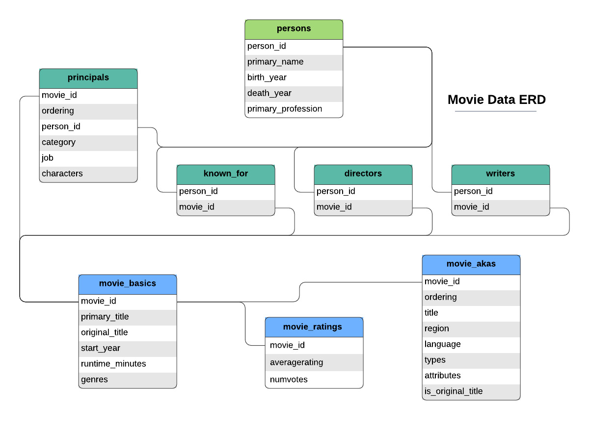
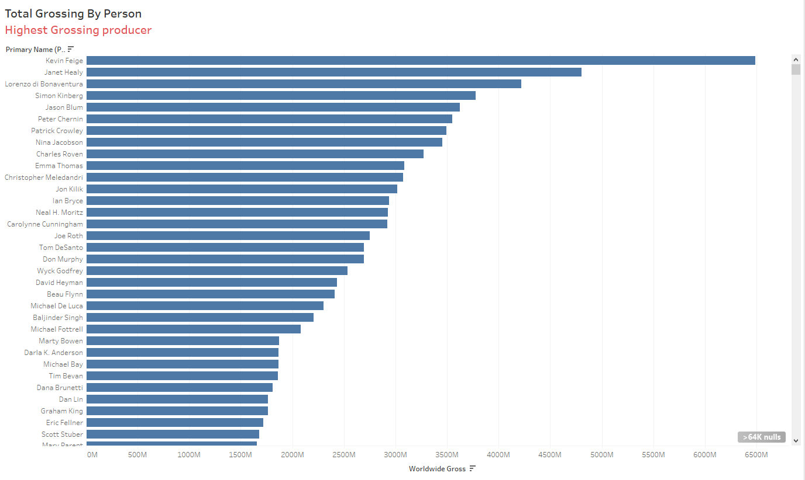
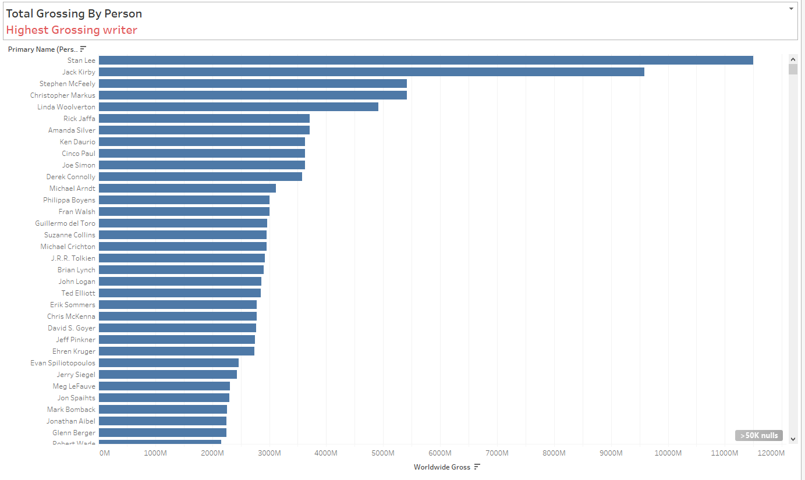

<h1 align="center">Hi 👋, We're Group 6</h1>

<h3 align="left">Connect with me:</h3>

Github Repository: [Click to Open the Project Github Repository](https://github.com/odhinto/Phase2-Group6-Project.git)

Tableau Dashboard: [Click to Open the Tableau Dashboard](https://public.tableau.com/views/Phase1_EDA/Dashboard2?:language=en-US&publish=yes&:sid=&:redirect=auth&:display_count=n&:origin=viz_share_link)

# **Problem Definition**

A recent profitable trend across most big companies is creation of original video content. Our company's expansion and diversification plans include getting in on this fun by creating a new movie studio. 
An analysis of box office performance is critical to identify a profitable formula for operating a profitable studio.

## Business Understanding

The primary objective of this exercise is to generate an accurate model for predicting box office success as a blueprint for running our proposed new movie studio

*   The highest rated movies with respect to attributes such as Genre, Region, Writers, Directors, Actors etc.
*   The most watched/voted movies with respect to attributes such as Genre, Region, Writers, Directors, Actors etc.
*   The highest grossing movies with respect to attributes such as Genre, Region, Writers, Directors, Actors etc.

The insights from this analysis will determine the kind of movies our studio focuses on and the people we approach to partner with us to ensure our studio is successful and profitable.

# **Data Preprocessing**

This section prepare the provided movie data for analysis. We intend to do the following:

*   Dataset Overview - Load and understand the data
*   Handling Missing Values using derived domain knowledge and imputation
*   Data Cleaning e.g. standardizing categorical values, deriving useful date data, removing duplicates etc

## **Dataset Overview**

It is imperative for us to understand the movie database first i.e.:

*   The data structure e.g. available tables, their columns, data types and presence of missing values
*   Establish the relevance of the data to our study
*   Identify useful columns to focus on

Data Understanding will prescribe subsequent cleaning steps to be done in the **Data Cleaning** subsection

### Python Libraries Initialization
First, we initialize common libraries we project to utilize in this exercise:

*   pandas to create and manipulate dataframes
*   seaborn and matplotlib to facilitate any requisite visualizations within the notebook
*   numpy for mathematical calculations
*   sqlite3 to navigate the movie database
*   etc

### Data Loading
We then load the dataset into python as a dataframe and embark on a data understanding exercise.

### Data Understanding

    
    
<em>Movie Database Schema</em>

The movie database contains the following tables with shown columns:

*   **principals**: The principals table details main people (using their person_id)that were involved with different movies (using the movie_id) and the capacities in which they were involved e.g. director, actor, producer etc. There could be a relationship between these people and the success of the movie in the box office.

    
*   **persons**: The persons table details the name, birth year, death year and primary professions of the various people using their person_id. There could be a relationship between the people involved in a movie and the success of the movie in the box office.

    
*   **known_for**: Known_for table details the various movies different people are known for by person_id and movie_id.

    
*   **directors**: Directors table details the various movies and the people they are known for by movie_id and person_id. There could be a relationship between the directors of a movie and the success of the movie in the box office.

    

*   **writers**: Writers table details the various movies and their pewriters by movie_id and person_id. There could be a relationship between the writers of a movie and the success of the movie in the box office.

    
*   **movie_basics**: Movie_basics table details the various movie titles, the year they were released, the run-time minutes and the various genres (there may be need for feature engineering around this aspect). There could be a relationship between these parameters and the success of a movie in the box office.

*   **movie_ratings**: This table shows the average rating for each movie by movie_id and also the number of votes it received (which could give insight into how many people watched it??). There could be a relationship between these parameters and the success of a movie in the box office.

    
*   **movie_akas**: This table shows other movie features e.g. the region, language, type and attributes. There could be a relationship between these features and the success of a movie in the box office.
    

# **Exploratory Data Analysis**

We used Tableau to explore the data and established the following insights:

1. **Average Rating Per Genre:**

   Musical, Fantastical and Sci-Fi Genres registered the highest incidence among the top rated genres
    

        
        
<em>Average Rating By Genre</em>

    

2. **Popularity by Genre:**

    Fantasy, Action and Adventure Genres Feature Frequently on the Popularity Meter
    

        
        
<em>Popularity By Genre</em>

    

3. **Average Profitability by Gentre:**

    Family, Horrors and Thrillers Register High Profitability i.e. profitability = (grossing/production budget) x 100%
   

        
        
<em>Average Profitability By Genre</em>

    

4. **Casting Insights:**

    The following are the highest grossing **actors** who consistently attract larger audiences:
    

        
        
<em>Highest Grossing Actors</em>

    

     The following are the highest grossing **actresses** who consistently attract larger audiences:
    

        
        
<em>Highest Grossing Actresses</em>

    

     The following are the highest grossing **directors** who consistently attract larger audiences:
    

        
        
<em>Highest Grossing Directors</em>

    

     The following are the highest grossing **producers** who consistently attract larger audiences:
    

        
        
<em>Highest Grossing Producers</em>

    

    The following are the highest grossing **writers** who consistently attract larger audiences:
    

        
        
<em>Highest Grossing Writers</em>

    

5. **Average Production Budget vs Average Profitability by Genre:**

  

# **Conclusion**

1. **Genre Focus:**
   - Focus on highly rated genres 

2. **Director and Writer Partnerships:**
   - Invest in partnerships with proven directors and writers to enhance the likelihood of success.

3. **Casting Strategy:**
   - Include at least one A-list actor in high-budget projects while ensuring strong scripts and storytelling to retain audience satisfaction.

5. **Budget Allocation:**
   - Focus on low- to mid-budget films with a clear emphasis on maximizing profit margins.

6. **Long-Term Strategy:**
   - Continuously analyze audience preferences and emerging trends to adapt to shifting market demands.

    
# **Recommendation**
These recommendations provide a roadmap for achieving consistent profitability and success in the competitive movie industry.   Among the top 30 most expensive movies, Family, Fantasy, Musicals yield the highest profitability at relatively low budget.

 

        
        
<em>Average Production Budget vs Average Profitability by Genre</em>

    

For a start, our company should focus on producing this genre.

Average Production Budget vs Average Profitability by Genre